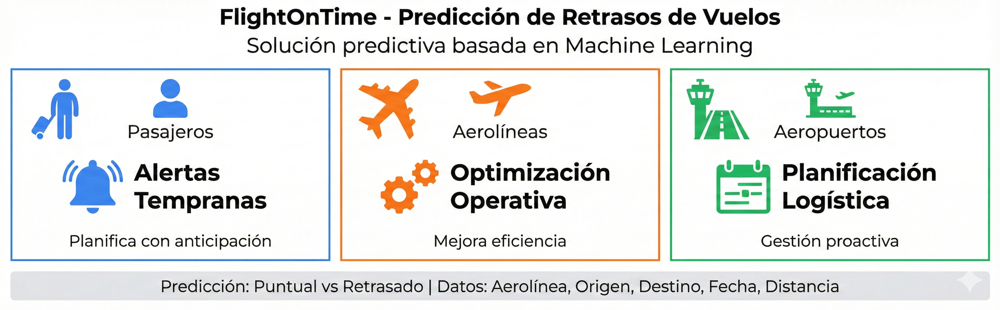
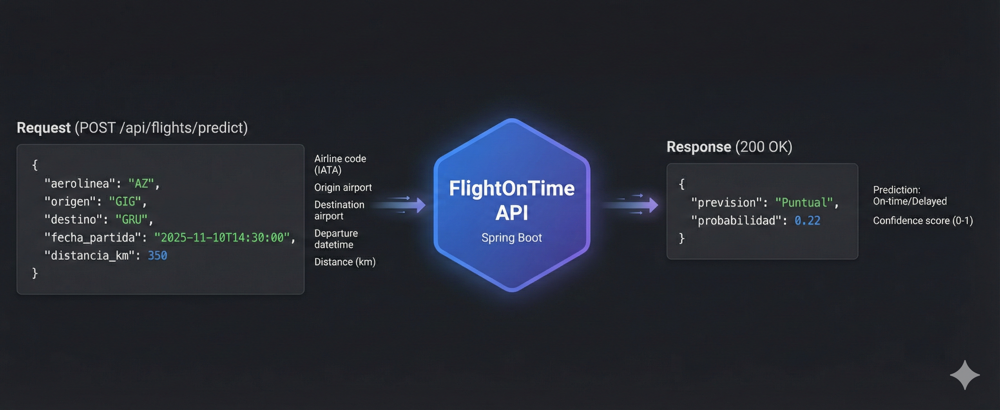
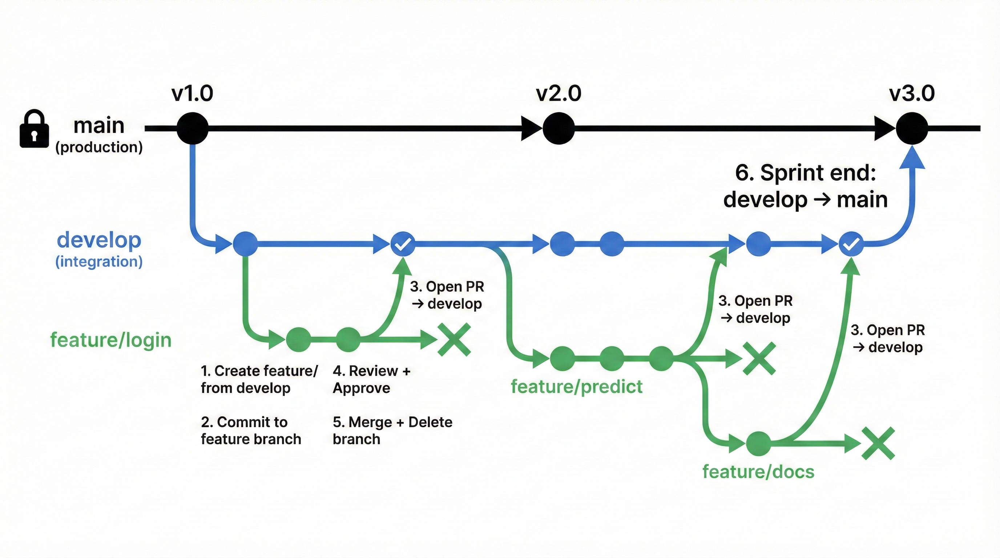
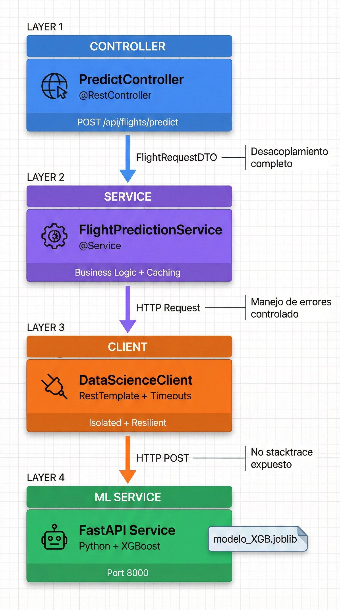
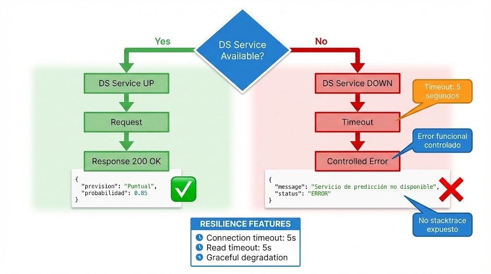

# FlightOnTime_mvp_H12-25-L-Equipo33

## Descripción del proyecto

FlightOnTime es una solución predictiva cuyo objetivo es estimar si un vuelo despegará de forma **puntual** o con **retraso**, a partir de información básica del vuelo como aerolínea, aeropuertos, fecha y hora de salida y distancia aproximada.

El sistema está pensado para apoyar la toma de decisiones de:
- Pasajeros, mediante alertas tempranas.
- Aerolíneas, optimizando su operación.
- Aeropuertos, mejorando la planificación logística.

  

## Objetivo del MVP

Desarrollar una **API REST** que reciba información de un vuelo y devuelva:
- La previsión del estado del vuelo (`Puntual` o `Retrasado`)
- La probabilidad asociada a dicha previsión

## Alcance funcional

- Clasificación binaria del estado del vuelo.
- Predicción basada en:
  - Aerolínea
  - Aeropuerto de origen
  - Aeropuerto de destino
  - Fecha y hora de salida
  - Distancia del vuelo
- Comunicación mediante JSON.

## Arquitectura general

- Backend: Java 17 + Spring Boot
- API REST
- Modelo de Machine Learning consumido por la API

## Contrato de integración

### Endpoint principal

### Entrada esperada
### JSON
{
  "aerolinea": "AZ",
  "origen": "GIG",
  "destino": "GRU",
  "fecha_partida": "2025-11-10T14:30:00",
  "distancia_km": 350
}
### Salida esperada
{
  "prevision": "Puntual",
  "probabilidad": 0.22
} 

  

---
## Reglas de colaboración del equipo

1. **No tocar `main` directamente.**  
   - Solo usar para versiones estables finales.

2. **Crear siempre ramas `feature/` desde `develop`.**  
   - Cada funcionalidad o tarea tiene su propia rama feature.

3. **Hacer commits solo en la rama feature asignada.**  
   - Nunca subir cambios directamente a `develop` o `main`.

4. **Abrir Pull Request (PR) de feature → develop.**  
   - Todo cambio debe pasar por PR para revisión.

5. **Revisar y aprobar PR antes de mergear.**  
   - Al menos un integrante debe revisar y aprobar.

6. **Borrar la rama feature después de mergear.**  
   - Mantiene el repositorio limpio.

7. **Merge de develop → main solo al final del sprint.**  
   - Garantiza que `main` siempre tenga código estable.

8. **Mantener la misma estructura de carpetas en todas las ramas.**  
   - `data-science/`, `backend/`, `docs/`, `frontend/`, etc.

9. **Sincronizar cambios de develop en tu feature antes de mergear si hubo actualizaciones.**     - Evita conflictos al integrar tu trabajo.

## Flujo de trabajo sugerido

1. Crear rama feature desde `develop`.  
2. Hacer commits en tu rama feature.  
3. Abrir Pull Request → develop.  
4. Revisar y aprobar PR.  
5. Mergear cambios y borrar la rama feature.  
6. Al final del sprint, mergear `develop` → `main`.

  

## Semana 3 — Integración con Data Science ##

**Objetivo de la semana**

Integrar el **modelo real de Data Science** al backend, garantizando:

- Desacoplamiento de capas
- Manejo de errores externos
- Resiliencia del sistema
- Estabilidad del endpoint /predict **sin modificar el controller**
-----
**Cambios clave respecto a Semana 2**

|**Aspecto**|**Semana 2**|**Semana 3**|
| :-: | :-: | :-: |
|Fuente de predicción|Mock|Modelo real|
|Comunicación|Interna|HTTP REST|
|Manejo de fallos DS|No aplica|Error controlado|
|Controller|Mock|Sin cambios|
|Arquitectura|Básica|Desacoplada|

-----
**Arquitectura de integración**

Controller

`   `↓

Service

`   `↓

ModelClient (HTTP)

`   `↓

FlightOnTime Data Science Service (FastAPI)

- El controller **no conoce el origen de la predicción**.
- El cliente de Data Science está **completamente aislado**.
- La arquitectura permite **volver a un mock** sin cambios estructurales.

  

-----
**Servicio de Data Science**

- Implementado en **FastAPI**
- Modelo cargado desde **joblib**
- Endpoint expuesto:

**Respuesta del servicio**

- Predicción real del modelo
- Probabilidad calculada por el modelo de Machine Learning
-----
**Manejo de errores externos**

Cuando el servicio de Data Science:

- Está caído
- No responde
- Retorna un error inesperado

-El backend **NO expone stacktrace**\
-Retorna un **error funcional y controlado**

**Ejemplo de respuesta de error**

{

`  `"message": "Servicio de predicción no disponible",

`  `"status": "ERROR"

}

  

-----
**Pruebas realizadas**

**Casos funcionales probados**

- Vuelo puntual
- Vuelo retrasado
- Error del servicio de Data Science

**Herramientas utilizadas**

- Postman
- cURL
- Pruebas manuales end-to-end
-----
**Cómo levantar el entorno**

**Servicio Data Science**

uvicorn flightontime\_microservicio\_ds:app --reload

**Backend Spring Boot**

mvn spring-boot:run

