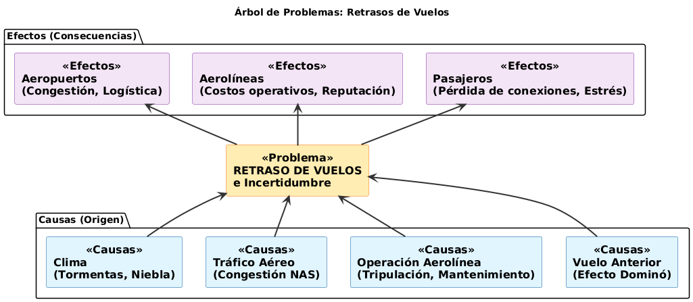

# ✈️ FlightOnTime - MVP H12-25-L-Equipo33

## 🏆 Insignias


---

## 📌 Índice

- [📙 Descripción del Proyecto](#-descripción-del-proyecto)
- [🌳 Problemática](#-problemática)
- [🎯 Objetivo del MVP](#-objetivo-del-mvp)
- [📋 Alcance Funcional](#-alcance-funcional)
- [🏗️ Arquitectura General](#️-arquitectura-general)
- [🔌 Contrato de Integración](#-contrato-de-integración)
- [👥 Reglas de Colaboración del Equipo](#-reglas-de-colaboración-del-equipo)
- [🔄 Flujo de Trabajo Sugerido](#-flujo-de-trabajo-sugerido)
- [📅 Semana 3 — Integración con Data Science](#-semana-3--integración-con-data-science)
- [🚀 Cómo Levantar el Entorno](#-cómo-levantar-el-entorno)
- [👨‍💻 Equipo de Desarrollo](#-equipo-de-desarrollo)
- [📜 Licencia](#-licencia)

---

## 📙 Descripción del Proyecto

FlightOnTime es una solución predictiva cuyo objetivo es estimar si un vuelo despegará de forma **puntual** o con **retraso**, a partir de información básica del vuelo como aerolínea, aeropuertos, fecha y hora de salida y distancia aproximada.

El sistema está pensado para apoyar la toma de decisiones de:
- Pasajeros, mediante alertas tempranas.
- Aerolíneas, optimizando su operación.
- Aeropuertos, mejorando la planificación logística.

<p align="center">
  
</p>

---

## 🌳 Problemática

Los retrasos de vuelos representan un problema significativo que afecta a múltiples actores del ecosistema aeronáutico. El siguiente diagrama ilustra las **causas raíz** que originan los retrasos y los **efectos** que estos generan en pasajeros, aerolíneas y aeropuertos.

<p align="center">
  
</p>

**FlightOnTime** busca mitigar estos efectos proporcionando **predicciones anticipadas** que permitan a todos los stakeholders tomar decisiones informadas antes de que el retraso ocurra.

---

## 🎯 Objetivo del MVP

Desarrollar una **API REST** que reciba información de un vuelo y devuelva:
- La previsión del estado del vuelo (`Puntual` o `Retrasado`)
- La probabilidad asociada a dicha previsión

---

## 📋 Alcance Funcional

- Clasificación binaria del estado del vuelo.
- Predicción basada en:
  - Aerolínea
  - Aeropuerto de origen
  - Aeropuerto de destino
  - Fecha y hora de salida
  - Distancia del vuelo
- Comunicación mediante JSON.

---

## 🏗️ Arquitectura General

| Componente | Tecnología |
|------------|------------|
| Backend | Java 17 + Spring Boot |
| API | REST |
| Modelo ML | XGBoost (Python + FastAPI) |

---

## 🔌 Contrato de Integración

### Endpoint Principal

**`POST /predict`**

### Entrada Esperada (JSON)

```json
{
  "aerolinea": "AZ",
  "origen": "GIG",
  "destino": "GRU",
  "fecha_partida": "2025-11-10T14:30:00",
  "distancia_km": 350
}
```

### Salida Esperada (JSON)

```json
{
  "prevision": "Puntual",
  "probabilidad": 0.22
}
```

<p align="center">
  
</p>

---

## 👥 Reglas de Colaboración del Equipo

1. **No tocar `main` directamente.**  
   - Solo usar para versiones estables finales.

2. **Crear siempre ramas `feature/` desde `develop`.**  
   - Cada funcionalidad o tarea tiene su propia rama feature.

3. **Hacer commits solo en la rama feature asignada.**  
   - Nunca subir cambios directamente a `develop` o `main`.

4. **Abrir Pull Request (PR) de feature → develop.**  
   - Todo cambio debe pasar por PR para revisión.

5. **Revisar y aprobar PR antes de mergear.**  
   - Al menos un integrante debe revisar y aprobar.

6. **Borrar la rama feature después de mergear.**  
   - Mantiene el repositorio limpio.

7. **Merge de develop → main solo al final del sprint.**  
   - Garantiza que `main` siempre tenga código estable.

8. **Mantener la misma estructura de carpetas en todas las ramas.**  
   - `data-science/`, `backend/`, `docs/`, `frontend/`, etc.

9. **Sincronizar cambios de develop en tu feature antes de mergear si hubo actualizaciones.**  
   - Evita conflictos al integrar tu trabajo.

---

## 🔄 Flujo de Trabajo Sugerido

1. Crear rama feature desde `develop`.  
2. Hacer commits en tu rama feature.  
3. Abrir Pull Request → develop.  
4. Revisar y aprobar PR.  
5. Mergear cambios y borrar la rama feature.  
6. Al final del sprint, mergear `develop` → `main`.

<p align="center">
  
</p>

---

## 📅 Semana 3 — Integración con Data Science

### Objetivo de la Semana

Integrar el **modelo real de Data Science** al backend, garantizando:

- Desacoplamiento de capas
- Manejo de errores externos
- Resiliencia del sistema
- Estabilidad del endpoint `/predict` **sin modificar el controller**

### Cambios Clave respecto a Semana 2

| Aspecto | Semana 2 | Semana 3 |
|:-------:|:--------:|:--------:|
| Fuente de predicción | Mock | Modelo real |
| Comunicación | Interna | HTTP REST |
| Manejo de fallos DS | No aplica | Error controlado |
| Controller | Mock | Sin cambios |
| Arquitectura | Básica | Desacoplada |

### Arquitectura de Integración

```
Controller
    ↓
Service
    ↓
ModelClient (HTTP)
    ↓
FlightOnTime Data Science Service (FastAPI)
```

- El controller **no conoce el origen de la predicción**.
- El cliente de Data Science está **completamente aislado**.
- La arquitectura permite **volver a un mock** sin cambios estructurales.

<p align="center">
  
</p>

### Servicio de Data Science

- Implementado en **FastAPI**
- Modelo cargado desde **joblib**
- Endpoint expuesto: `POST /predict`

**Respuesta del servicio:**
- Predicción real del modelo
- Probabilidad calculada por el modelo de Machine Learning

### Manejo de Errores Externos

Cuando el servicio de Data Science:
- Está caído
- No responde
- Retorna un error inesperado

El backend **NO expone stacktrace** y retorna un **error funcional y controlado**:

```json
{
  "message": "Servicio de predicción no disponible",
  "status": "ERROR"
}
```

<p align="center">
  
</p>

### Pruebas Realizadas

**Casos funcionales probados:**
- Vuelo puntual
- Vuelo retrasado
- Error del servicio de Data Science

**Herramientas utilizadas:**
- Postman
- cURL
- Pruebas manuales end-to-end

---

## 🚀 Cómo Levantar el Entorno

### Servicio Data Science

```bash
uvicorn flightontime_microservicio_ds:app --reload
```

### Backend Spring Boot

```bash
mvn spring-boot:run
```

---

## 👨‍💻 Equipo de Desarrollo

| Integrante | Rol | LinkedIn | GitHub |
|------------|-----|----------|--------|
| Angeles Morales | Data Scientist | [](https://www.linkedin.com/in/angeles-morales-ab0a7828a) | [@angelesGladin](https://github.com/angelesGladin) |
| Edson Castañeda | Backend Developer | [](https://www.linkedin.com/in/edsoncasta%C3%B1eda/) | [@EdsonCasta](https://github.com/EdsonCasta) |
| Juan Mesa | Data Scientist | [](https://www.linkedin.com/in/jmesavergara/) | [@Juanmeve837](https://github.com/Juanmeve837) |
| Enrique Oscar Contreras | Backend Developer | [](https://www.linkedin.com/in/enrique-oscar-contreras-ab6329b1/) | [@RickiContreras](https://github.com/RickiContreras) |
| Rodrigo García López | Data Scientist | [](https://www.linkedin.com/in/rodrigo-garcia-lopez-165b99197/) | [@rogarlop](https://github.com/rogarlop) |
| Ernesto Daniel López | Backend Developer | [](https://www.linkedin.com/in/ernesto-l%C3%B3pez-bedolla-29548b1a2/) | [@d4nye1](https://github.com/d4nye1) |
| Norma Noemí Salcedo | Backend Developer | [](https://www.linkedin.com/in/norma-salcedo/) | [@normins](https://github.com/normins) |
| Sergio Alonso Bravo | Backend Developer | [](https://www.linkedin.com/in/sergio-alonso-bravo-858414286) | [@the-serch](https://github.com/the-serch) |
| Oscar Fernando Paye Cahui | Data Engineer | [](https://pe.linkedin.com/in/oscar-paye01) | [@FerPaye01](https://github.com/FerPaye01) |
| Zaida Donoso Valdivia | Data Scientist | [](https://www.linkedin.com/in/zaida-donoso-57949461/) | [@Saya-Sayita](https://github.com/Saya-Sayita) |

---

## 📜 Licencia

Este proyecto está bajo la licencia MIT. Consulta el archivo [LICENSE](LICENSE) para más detalles.

---

**¿Preguntas o sugerencias?** Abre un issue en GitHub o contacta al equipo de desarrollo.
