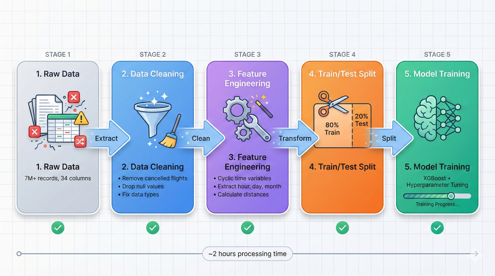
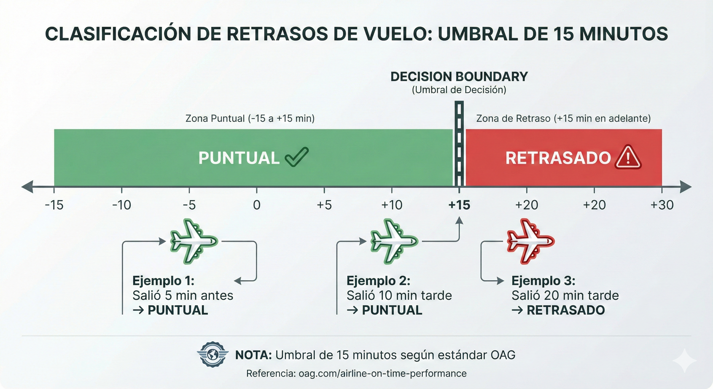
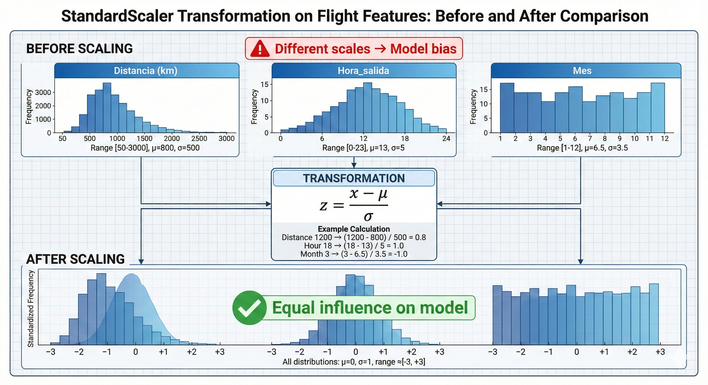
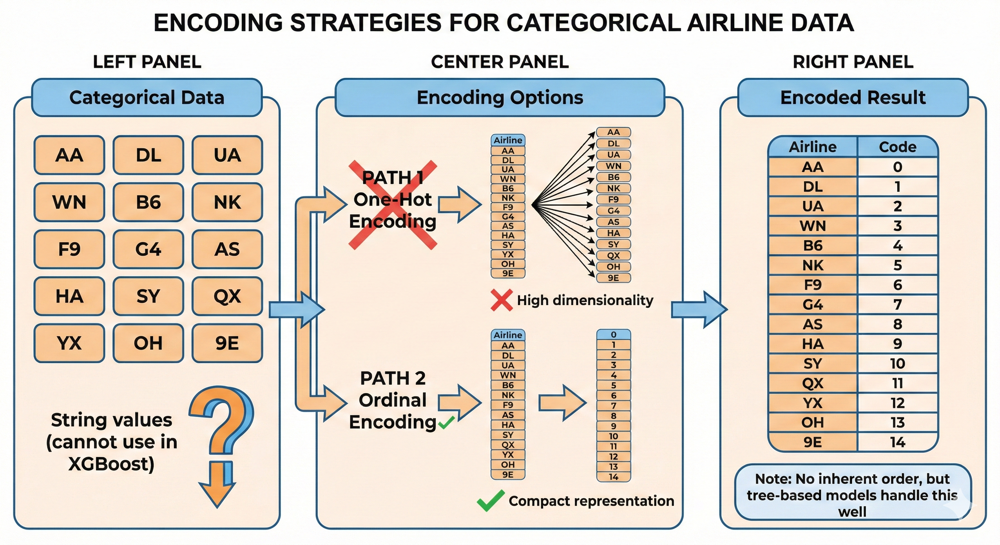
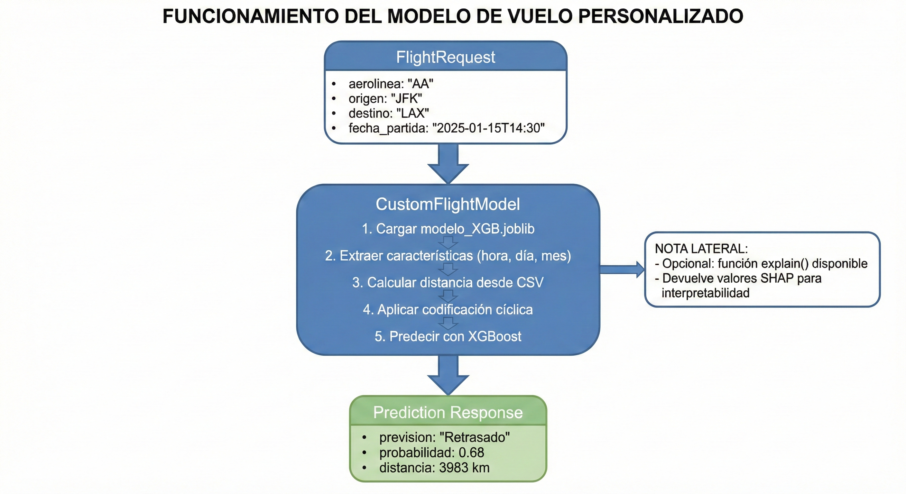

## Documentación del modelo de Machine Learning utilizado en el proyecto

### **1) Base de datos**

Conjunto de datos para la predicción de retraso de vuelos. La base de datos propuesta consta originalmente de 7079081 registros de vuelo dentro de U.S.A. pertenecientes al año 2024. La base de datos consta de 34 columnas, las cuales contienen información
tanto previa al vuelo (hora programada del vuelo, fecha, origen y destino, etc) como una vez el vuelo ya ha ocurrido y se conocen otros datos (como la cantidad de tiempo en el aire, o el tiempo desde el aterrizaje hasta el descenso de pasajeros). La fuente de
datos original puede ser consultada <a href="https://www.transtats.bts.gov/">aquí</a> y la tabla de la que fue extraída la información con los campos descritos en el paso 2, fue la tabla <a href="https://www.transtats.bts.gov/DL_SelectFields.aspx?gnoyr_VQ=FGJ&QO_fu146_anzr=b0-gvzr">Reporting Carrier On-Time Performance (1987-present)</a>
de la cual fueron filtrados los vuelos solamente del año 2024 por la gran cantidad de información presente. Cabe recalcar que dicha base de datos contiene vuelos solamente internamente en U.S.A. y utilizarla para realizar predicciones sobre aeropuertos
fuera de este país, sería incorrecto al no contar con datos para desarrollar un modelo predictivo de esta índole correctamente.

---

### **Arquitectura del Sistema**

  

El diagrama anterior muestra la arquitectura completa del sistema FlightOnTime, desde la ingesta de datos de BTS hasta el despliegue del modelo en producción mediante FastAPI, integrándose con el backend en Spring Boot.

---

### **2) Análisis exploratorio de datos**

Como etapa previa al modelado, se realizó un Análisis Exploratorio de Datos (EDA) con el objetivo de comprender la estructura del dataset, validar su coherencia operativa, identificar patrones relevantes y definir un conjunto de variables ex-ante que pudiera ser utilizado en un modelo predictivo sin introducir fuga de información (data leakage).

El EDA se realizó sobre la base de datos de vuelos 2024, que contiene más de 7 millones de registros y 35 variables. Debido al volumen del dataset, el análisis combinó revisión estadística, validación de formatos y visualizaciones sobre muestras representativas, para mantener eficiencia computacional sin perder interpretabilidad.

#### **Flujo del Pipeline de Datos**

  

El diagrama muestra las fases principales del procesamiento de datos: desde la extracción de datos crudos de BTS, pasando por la limpieza y validación, ingeniería de características, división train/test con balanceo de clases, hasta el entrenamiento final del modelo XGBoost.

#### **2.1 Revisión inicial del dataset**

Se generó una copia de seguridad del dataframe crudo con el objetivo de preservar el estado original ante posibles errores durante limpieza o transformación de datos. Posteriormente, se revisó la estructura general del dataset mediante una vista preliminar (<code>head()</code>), su dimensión (<code>shape</code>) y la tipificación de columnas junto con la presencia de valores nulos (<code>info()</code>). La inspección inicial mostró un consumo de memoria superior a 1.8 GB, lo cual justificó realizar limpieza y optimización antes de procesos intensivos de modelado.

#### **2.2 Normalización semántica de columnas y diccionario de variables**

Con el objetivo de mejorar la legibilidad y consistencia del análisis, se realizó un renombrado de columnas a español, con nombres descriptivos y uniformes. Posteriormente se construyó un diccionario de datos, detallando la descripción operativa de cada variable, lo cual permitió realizar una “limpieza conceptual” para distinguir variables disponibles antes del despegue frente a variables que sólo se conocen después del evento, evitando decisiones incorrectas sobre valores nulos esperados.

#### **2.3 Revisión y estandarización de tipos de dato**

Durante la exploración se detectaron ajustes necesarios en tipos de datos para reflejar correctamente su naturaleza: la variable temporal <code>fecha_vuelo</code> se convirtió a <code>datetime</code> para habilitar análisis por fecha; las variables binarias <code>cancelado</code> y <code>desviado</code> se convirtieron a booleanos por representar estados lógicos; y el identificador <code>numero_vuelo</code> se ajustó a entero con soporte de nulos (<code>Int64</code>) ya que su formato decimal provenía de valores faltantes. Se ignoraron advertencias de tipo (<code>DtypeWarning</code>) en columnas con tipos mixtos que no forman parte del dataset final de modelado.

#### **2.4 Análisis de valores nulos y consistencia operativa**

Se calculó el conteo de valores faltantes por columna y se observó que los nulos se concentran principalmente en horarios reales (salida/llegada), retrasos y variables operativas (taxi, ruedas, tiempo en aire). Esta distribución fue considerada esperada, ya que vuelos cancelados o desviados no cuentan con tiempos reales, y ciertos procesos operativos pueden registrar información incompleta en algunos casos. Este hallazgo guió las decisiones de filtrado posteriores, aplicadas únicamente sobre campos críticos para la definición de retraso.

  

#### **2.5 Filtrado de vuelos no útiles para el MVP**

Dado que el objetivo es predecir retrasos en vuelos operados, se excluyeron del análisis los vuelos cancelados y desviados, ya que no representan operaciones completas comparables con vuelos regulares y no cuentan con tiempos reales confiables para etiquetar retraso. Este filtrado permite que el modelo aprenda patrones consistentes del sistema operativo real de puntualidad.

#### **2.6 Eliminación de variables con fuga de información (data leakage)**

Se identificaron variables con información posterior al evento o que explican directamente el retraso una vez ocurrido, como los retrasos por causa (<code>retraso_clima</code>, <code>retraso_aerolinea</code>, etc.) y <code>codigo_cancelacion</code>. Estas variables fueron eliminadas debido a que su inclusión provocaría sobreajuste y métricas artificialmente altas, al incorporar información que no estaría disponible en un escenario de predicción previa al despegue.

#### **2.7 Tratamiento de valores nulos críticos**

Para definir correctamente la variable objetivo y asegurar consistencia en el análisis, se eliminaron registros con valores faltantes en columnas críticas: <code>hora_salida_real</code>, <code>hora_llegada_real</code>, <code>retraso_salida</code> y <code>retraso_llegada</code>. Se eligió eliminación (<i>drop</i>) en lugar de imputación, ya que estos campos representan resultados operativos que no pueden estimarse confiablemente sin introducir sesgo.

#### **2.8 Definición de la variable objetivo**

El objetivo del proyecto es predecir retrasos antes del despegue, por lo que la variable objetivo se definió en función del retraso de salida. Se consideró un vuelo retrasado si <code>retraso_salida &gt; 15</code> minutos, de acuerdo con el criterio estándar de la industria para definir puntualidad operacional. Referencia: https://www.oag.com/airline-on-time-performance-defining-late

  

El diagrama muestra claramente el umbral de 15 minutos que separa vuelos puntuales de retrasados, siguiendo el estándar de la industria aérea (OAG).

#### **2.9 Ingeniería de variables temporales ex-ante**

Para representar patrones operativos sin introducir información posterior al evento, la hora programada de salida (HHMM) se transformó a componentes interpretables: <code>hora_salida</code>, <code>minuto_salida</code> y el indicador <code>fin_de_semana</code>. Adicionalmente, se realizó una validación ligera del formato HHMM; se detectó un único registro fuera de rango, eliminado por ser una proporción insignificante del total y para evitar ruido.

#### **2.10 Análisis descriptivo de variables numéricas continuas**

Se aplicó <code>describe()</code> sobre variables numéricas continuas para validar rangos, dispersión y coherencia operativa. Se observaron distribuciones asimétricas y alta variabilidad, lo cual es esperable en operación aérea. Las variables de retraso presentan medias positivas pero medianas negativas (más del 50% de vuelos sale/llega antes del horario programado), mientras que los retrasos significativos se concentran en una fracción menor. Asimismo, se observó coherencia entre tiempos programados y reales, y una distribución sesgada hacia vuelos de corta y media distancia. Los valores extremos se interpretaron como eventos operativos reales y se conservaron.

  

Nota: variables operativas como <code>taxi_salida</code>, <code>taxi_llegada</code>, <code>tiempo_real</code> y <code>tiempo_en_aire</code> se analizaron en el EDA para validación de consistencia, pero no se consideran variables ex-ante para el dataset final de modelado.

#### **2.11 Visualizaciones exploratorias y hallazgos operativos**

Para el análisis visual se utilizaron muestras representativas (por eficiencia computacional) y se exploraron relaciones relevantes asociadas a la variable objetivo. A continuación se incluyen gráficas estáticas para consulta rápida y enlaces a las versiones interactivas generadas en Plotly.

<b>• Dispersión del retraso de salida vs retraso de llegada </b>

  

  <a href="https://angelesgladin.github.io/docs_flight_eda/dispersion_retraso_salida_retraso_llegada.html"><b>Versión interactiva</b></a>

Se observa una relación positiva consistente entre retraso de salida y retraso de llegada, con evidencia de recuperación parcial del tiempo en algunos casos.

<b>• Distribución de la variable objetivo</b>

  

  <a href="https://angelesgladin.github.io/docs_flight_eda/distribucion_variable_objetivo.html"><b>Versión interactiva</b></a>

La distribución confirma un desbalance moderado (~20% retrasados vs ~80% puntuales), el cual se considera en la etapa de modelado.

<b>• Proporción de vuelos retrasados por aerolínea (Top 10)</b>

  

  <a href="https://angelesgladin.github.io/docs_flight_eda/retraso_por_aerolinea.html"><b>Versión interactiva</b></a>

Se aprecian diferencias significativas entre aerolíneas, lo cual sugiere patrones operativos que pueden ser aprendidos por el modelo.

<b>• Probabilidad de retraso según hora de salida</b>

  

  <a href="https://angelesgladin.github.io/docs_flight_eda/retraso_hora_de_salida.html"><b>Versión interactiva</b></a>

Se observa una tendencia creciente conforme avanza el día, consistente con la acumulación de demoras operativas.

<b>• Distancia del vuelo vs retraso (boxplot)</b>

  

  <a href="https://angelesgladin.github.io/docs_flight_eda/distancia_contra_retraso.html"><b>Versión interactiva</b></a>

La comparación de distribuciones permite identificar diferencias estructurales entre vuelos puntuales y retrasados.

<b>• Semana vs fin de semana</b>

  

  <a href="https://angelesgladin.github.io/docs_flight_eda/retraso_semana_vs_fin_de_semana.html"><b>Versión interactiva</b></a>

Se observan diferencias en la tasa de retraso entre semana y fin de semana, lo cual confirma que <code>fin_de_semana</code> aporta señal útil y es conocida antes del despegue.

#### **2.12 Correlación exploratoria con la variable objetivo**

Se analizó la correlación entre variables numéricas y temporales transformadas con la variable objetivo <code>vuelo_retrasado</code>. La correlación cuantifica asociación lineal (valores cercanos a 1 o -1 indican relación fuerte; valores cercanos a 0 indican relación débil). Es importante destacar que la correlación no implica causalidad; sin embargo, permite identificar señales potencialmente útiles para el desempeño del modelo.

<b>• Variables numéricas</b>

  

  

  <a href="https://angelesgladin.github.io/docs_flight_eda/correlacion_variable_objetivo.html"><b>Versión interactiva</b></a>

Se observaron correlaciones bajas a moderadas, lo cual respalda que el modelo debe capturar relaciones no lineales y combinaciones de variables para maximizar desempeño predictivo.

<b>• Variables temporales</b>

Dado que las variables temporales presentan comportamiento cíclico, sus coeficientes deben interpretarse como tendencias exploratorias y no como relaciones causales estrictas. 

  

  <a href="https://angelesgladin.github.io/docs_flight_eda/correlacion_variables_temporales_vs_vuelo_retrasado.html"><b>Versión interactiva</b></a>

Estas correlaciones indican que el momento del día y el tipo de día (semana o fin de semana) influyen en la probabilidad de retraso, aunque no de forma estrictamente lineal. Este resultado refuerza la utilidad de las variables temporales como señales complementarias dentro de un modelo predictivo, especialmente en enfoques no lineales.

#### **2.13 Exportación del dataset final y cierre de etapa**

Como producto de la fase de limpieza y EDA se generó un dataset final para modelado: <code>df_clean_modelo</code>, el cual contiene únicamente vuelos operados (no cancelados ni desviados), excluye variables con fuga de información, e incluye variables disponibles antes del despegue junto con la variable objetivo binaria <code>vuelo_retrasado</code>, sin valores nulos críticos.

Se conservaron dos variantes:

<ol>
  <li><b>Dataset para modelado (<code>df_clean_modelo</code>)</b>: contiene únicamente variables permitidas + variable objetivo.</li>
  <li><b>Dataset completo limpio (<code>df_clean</code>)</b>: se conserva opcionalmente para auditoría/EDA, ya que mantiene variables operativas utilizadas para análisis exploratorio.</li>
</ol>

Finalmente, se destaca que el dataset presenta un desbalance moderado de clases (~20/80), y que los pasos de normalización y codificación categórica se dejan al pipeline de modelado definido en la siguiente sección.

### **3) Selección de características (features) o variables predictoras**

Como base de datos previa, se utilizaron los registros limpios, provenientes del notebook "DataScience.ipynb". Dicho notebook realiza la limpieza de registros duplicados, faltantes, formatos, y sugiere las variables a utilizar en el modelo a desarrollar.
Posteriormente se realizó la escritura del notebook "DataScience_seleccion-features.ipynb". En este segundo notebook, se realizó una matriz de correlación, así como la prueba de Cramers V, para determinar la idoneidad de elección de variables que tuvieran
una alta asociación. La matriz de correlación se realizó para variables numéricas, y la prueba de Cramers V para variables categóricas. Con base en ello, se seleccionaron las variables predictoras como aquellas con mayor asociación (o capacidad de distinción) 
con la clasificación requerida (retraso, a tiempo).

 

En el mismo notebook, se decidió que las variables temporales serían codificadas de manera cíclica para guardar la temporalidad presente en los datos. Para más detalle puede consultarse dicho notebook. De igual forma, se discutió y decidió que dentro de los procesos
internos del modelo, de preparación de datos previo al entrenamiento (pipeline) se incluiría la extracción de variables numéricas a partir de una variable de tipo hora y fecha, así como la extracción de la distancia entre aeropuertos al ser éste un dato
imposible de saber a priori por el usuario final.

  

La codificación cíclica (sin/cos) preserva la continuidad temporal, asegurando que la hora 23 esté cerca de la hora 0, a diferencia de la codificación lineal que las trataría como extremos opuestos.

### **4) Selección y entrenamiento del modelo**

Una vez determinados los hallazgos de la sección 3, se procedió con el entrenamiento de modelos. Estos procesos son realizados y discutidos detalladamente en el notebook "DataScience_ModelosML.ipynb". En este notebook, se obtiene una base de datos limpia, como
lo realizó la sección 2, pero incluyendo los campos relevantes para el desarrollo del modelo final. Es decir, se incluyeron las variables de fecha y hora, aeropuerto origen, aeropuerto destino, aerolínea y la distancia (misma que se genera directamente dentro del
entrenamiento del modelo, pero requiere ser visualizada durante la fase del entrenamiento mediante un diccionario para estar en posibilidad de recuperarla posteriormente, en fase de prueba). En dichos experimentos, se realizaron las definiciones de dos funciones:
una utilizada para extraer las variables determinadas como las más informativas a partir de la fecha, y la otra para generar o recuperar la distancia a partir del par aeropuerto origen-destino. Esta última función funciona mediante un diccionario, guardado al serializar el modelo, que asocia la clave del aeropuerto origen-destino con su distancia correspondiente.

También, en dicho notebook, se realizó un remuestreo de datos con la finalidad de realizar un balanceo de clases. Este proceso es de utilidad ya que un gran desbalanceo tiende a predecir la categoría más frecuente en la base de datos. Esto vuelve de poca
o nula aplicabilidad y utilidad un modelo en entornos del mundo real. A pesar de que existen técnicas avanzadas para dicho remuestreo, muchas de ellas están basadas en la medición de distancias entre puntos (lo que involucra la necesidad de calcular la diferencia
entre cada registro, es decir, cada fila; con todos los demás, lo que lo vuelve computacionalmente pesado) por lo que al contar con una gran cantidad de registros, se optó por realizar un submuestreo de la clase mayoritaria (en nuestro caso, vuelos a tiempo) 
de una manera aleatoria, para igualar la cantidad de ejemplos de la clase minoritaria (vuelos retrasados en nuestra base de datos). Al utilizar esta técnica de submuestreo, se elimina la carga computacional debida a los métodos de remuestreo basados en distancia, y se aseguró una cantidad equiparable de ejemplos para ambas categorías, para asegurar un aprendizaje equilibrado del modelo.

  

El proceso de random undersampling reduce la clase mayoritaria (vuelos puntuales) de 80% a 50%, igualándola con la clase minoritaria (vuelos retrasados) para prevenir sesgo del modelo hacia la clase dominante.

Para la parte de preprocesamiento de datos, previo al entrenamiento del modelo, se utilizaron dos estrategias: Standard Scaler y ordinal encoder. La estrategia de escalado estándar fue utilizada para cambiar la escala de las variables numéricas de cualquier escala para normalizarlas a tener una media de cero y una desviación estándar de 1. Esto es útil pues permite evitar que una característica en una escala mucho mayor que otra, domine el entrenamiento, y de cierta forma normaliza su impacto en las predicciones. Además, la gran mayoría de modelos de sklearn (librería seleccionada para realizar el entrenamiento de modelos) requiere datos dentro de cierto rango, y si bien existen modelos invariantes a escalas, se optó por estandarizar este paso y de cualquier forma escalar las entradas numéricas. En lo que respecta a la codificación ordinal, esto fue seleccionado ya que en el paso 3 se observó una gran cantidad de categorías tanto para aeropuertos de origen-destino, como para aerolíneas. Lo ideal habría sido utilizar otra técnica de codificación como One Hot Encoder, pero esto resultaría en un problema de aumento de la dimensionalidad muy problemático, tanto para el tiempo de entrenamiento como para la redundancia y tamaño horizontal (en features) del modelo. Por eso y con la finalidad de mantenerlo simple, se optó por codificar las variables categóricas como ordinales, a pesar de no contar con un orden definido previo.

  

El StandardScaler transforma todas las variables numéricas a una escala común (media=0, desviación estándar=1), evitando que features con rangos grandes dominen el entrenamiento del modelo.

  

El OrdinalEncoder convierte variables categóricas (aerolíneas, aeropuertos) en valores numéricos, evitando la alta dimensionalidad que generaría One-Hot Encoding con 15 aerolíneas y cientos de aeropuertos.

Se probaron distintos modelos durante el entrenamiento inicial como candidatos para servir como modelo a mejorar. Estos incluyeron pero no se limitaron, a random forest, regresión logística, XGB Classifier y LGBM Classifier. En la notebook "Optimizando_modelos_NoRNN.ipynb" también se realizaron pruebas con distintas proporciones de datos y modelos. En ella se determinó y se realizó un análisis muestral en el que se determinó que a partir de ciertas muestras, el incremento en el desempeño del modelo dejaba de ser significativamente mejor (350000 registros bastan para entrenar un modelo lo suficientemente potente), alcanzando resultados similares en la métrica primaria definida (Área AUC-ROC) en ambas propuestas. 

Retomando la libreta "DataScience_ModelosML.ipynb", se determinó que el mejor modelo base sin ajuste fue XGBoost. Este modelo fue el que fue optimizado en hiperparámetros, y se validó su desempeño mediante validación cruzada. Se realizó una búsqueda de hiperparámetros en un espacio de parámetros definido y se realizó un ajuste de hiperparámetros aleatorio. Esto no asegura contar con el mejor modelo, pero al contar con una gran cantidad de hiperparámetros a ajustar, otras estrategias de ajuste (por ejemplo, grid search, la cual realiza todas las combinaciones posibles definidas) son más costosas computacionalmente. El ajuste aleatorio permite un balance entre un modelo lo suficientemente potente y una disminución en el tiempo de entrenamiento al disminuir las combinaciones probadas. En particular, durante este ajuste, se probaron 30 combinaciones aleatorias de hiperparámetros diferentes y se validó su desempeño con una validación cruzada con k = 3, es decir, con tres iteraciones o entrenamientos del modelo sobre distintas particiones de datos.

Con esta estrategia se logró alcanzar un modelo que alcanzó un AUC-ROC de 0.718 en el conjunto de prueba, después de recuperar el modelo con hiperparámetros ajustados. Finalmente, se probó que el modelo generara predicciones completamente aleatorias (a esta prueba se le llamó Dummy model) y se validó que la métrica de AUC-ROC superara el umbral alcanzado por ese modelo "Dummy". También se realizó una prueba para "envolver" el modelo desarrollado en una clase que personalizara las salidas de dicho modelo, en las que se retornaran las etiquetas como variable string de datos, en lugar de 0s y 1s (es decir, retornar a tiempo y retrasado) así como la probabilidad de ocurrencia de la clase seleccionada. Cabe mencionar que dicha probabilidad de ocurrencia depende de la etiqueta de clase. Es decir, si la etiqueta de clase es "A tiempo", la probabilidad estará en el rango de 0.5-1 y si la etiqueta de clase es "Retrasado", la probabilidad también estará en el rango de 0.5-1. Esto es de esta forma pues la probabilidad de clase representa la probabilidad o la confiabilidad con la que el modelo predice una etiqueta en particular, y siempre se muestra la etiqueta predicha por el modelo y la confianza del modelo para esa predicción en particular (esto representa un porcentaje donde 0.5 representa el 50% de confianza, 0.65 el 65%, 0.78 el 78% y 1 el 100%).

### **5) Serialización del modelo**

Como etapa final de Data Science, se realizó la serialización del modelo para permitir que éste fuera cargado y consumido desde una aplicación externa (en este caso, un endpoint FastAPI que consume el modelo entrenado, por parte del equipo de Backend).

La serialización del modelo consistió en las siguientes actividades:

- Escritura de archivo feature_engineering_functions.py
- Serialización del modelo entrenado en formato .joblib
- Generación de archivo requirements.txt
- Escritura de archivo custom_class.py
- Generación de notebook "Ejemplo_carga_modelo_ML.ipynb"

#### **5.1) feature_engineering_functions.py**

Archivo de python que contiene las funciones denominadas "calcular_distancia" y "extraer_features_fecha". La primera de ellas realiza la vinculación entre el aeropuerto origen-destino con una distancia, al leer un diccionario previamente guardado y consultarlo. Esta generación de distancia se asigna a una nueva columna creada del dataframe de entrada, que no contiene dicha columna. Esta función para recuperar o generar la distancia es un paso dentro del pipeline definido para el entrenamiento del modelo.

La segunda función, denominada "extraer_features_fecha" lo que realiza es la extracción de características definidas como relevantes para que el modelo prediga con cierto grado de probabilidad. Estas características que extrae de dicho objeto (que es de tipo fecha y hora) son la hora de salida del vuelo, el día de la semana, el mes en el que ocurrió el vuelo y una variable de si el día extraído cayó en fin de semana o entre semana. Luego, la misma función implementa la transformación de dichas características extraídas, que son numéricas, a variables cíclicas. Esto es importante pues de esta forma el carácter temporal se respeta, cosa que se vería perdida, llevando a un modelo inferior, de solamente codificar esas características temporales como números enteros secuenciales. Esta función es el segundo paso dentro del pipeline definido para el entrenamiento del modelo.

#### **5.2) Serialización del modelo**

La serialización del modelo consistió en guardar el modelo entrenado en un archivo .joblib. Para lograr cargar y utilizar el modelo correctamente, es necesario contar con las mismas librerías y el entorno de Python utilizado durante el entrenamiento del modelo. Para asegurar consistencia y evitar errores en la carga del modelo, se generó un archivo denominado "requirements.txt" en el cual se encuentran definidas las versiones de las librerías mínimas a instalar para poder consumir el modelo correctamente. Este archivo, denominado requirements.txt, simplemente debe instalarse en el entorno utilizado para desarrollar la aplicación de FastAPI, lo que puede realizarsem mediante la línea de comandos (pip install -requirements.txt). En este mismo directorio se encuentra el modelo utilizado .joblib, el cual es la versión ajustada en hiperparámetros del modelo para ser cargado por la aplicación (modelo entrenado con hiperparámetros óptimos obtenidos en el archivo DataScience_ModelosML.ipynb".

#### **5.3) custom_class.py**

Finalmente, se decidió "envolver" el modelo serializado en una clase personalizada, la cual puede ser modificada, escalada, o formateada en sus salidas para entregar la información en el formato en el que el equipo considere más adecuado y útil. La clase hace uso de una función .predict que funciona como una forma de sobrecarga de la función original de los modelos de scikit-learn. Dicha función debe recibir el registro o la información del vuelo de la que se pretende determinar o predecir y ésta retorna la predicción ("A tiempo", "Retrasado") del modelo, la probabilidad o la confianza con la que asegura que exista un retraso o no (formato decimal) y a petición del equipo de backend, la distancia, para mostrarla o trabajarla en el frontend o en la API. Cabe mencionar que la probabilidad que muestra el modelo, siempre irá de 0.5-1, 0.5 representando el 50% de probabilidad o la confianza de predecir que un vuelo se retrasará o no y 1 representando el 100%. No puede visuailzarse menos del 50% de probabilidad, pues la etiqueta que se retorna por parte del modelo solamente es la clase elegida por el modelo y por consiguiente, la de mayor probabilidad. En otras palabras, el modelo solo muestra la clase ganadora. La probabilidad asociada no puede ser menor a 0.5 porque, al tratarse de un problema binario, las probabilidades de ambas clases suman 1. El modelo elige como predicción la clase con mayor probabilidad, y esa será siempre ≥ 0.5.

En caso de que se requiera producir una explicación de cómo decide el modelo, se proporciona la función explain, la cual recibe el registro a revisar, y regresa, de forma ordenada por importancia, las características que utiliza el modelo como las más relevantes para determinar si un vuelo se retrasa o llega a tiempo. En este primer intento de explicación, se usan los coeficientes shap, los cuales entre más grandes sean, indican una mayor importancia de dicha variable, en una consulta en particular. A mayor coeficiente, mayor relevancia de dicha característica para determinar retrasos. Esta importancia u orden será variable o cambiante entre cada consulta particular, lo que permite realizar una explicación por evento, en lugar de una explicación global o invariante. La función retorna tanto los nombres de las características usadas como los coeficientes shap en un dataframe. Se deja a discreción de los equipos la forma en la que se debe entregar esa información para aprovecharla de mejor manera, si es de utilidad para el análisis o se debería descartar.

  

El diagrama muestra el flujo completo del Custom Flight Model: desde la entrada de datos del vuelo, pasando por el procesamiento interno (carga del modelo, extracción de features, encoding cíclico, cálculo de distancias), hasta la salida con la predicción, probabilidad y distancia.

#### **5.4) Ejemplo de uso y consumo del modelo**

 En el archivo "Ejemplo_carga_modelo_ML.ipynb" se encuentra la demostración, mediante un ejemplo, de cómo consumir en Python el modelo entrenado. Basta con instalar los requerimientos, importar las librerías de dicho archivo, cargar e importar las clases y funciones definidas, definir uno o varios ejemplos para consultar al modelo, crear un objeto de la clase personalizada a partir del modelo cargado con joblib y llamar a la función de la clase personalizada (ya sea predict o explain) para obtener los resultados del modelo entrenado. Cabe mencionar que el modelo maneja errores en la entrada. Es decir, si la aerolínea, el aeropuerto origen o el aeropuerto destino no existen, los acepta y genera una distancia de 0 por defecto, y los codifica internamente para el modelo como -1. Esto permite manejar errores al predecir incluso con aeropuertos desconocidos, aunque la predicción sería errónea o inexacta, ya que el modelo está desarrollado para usarse con códigos IATA de aeropuertos de USA así como las 15 aerolíneas de USA presentes en la base de datos original.

