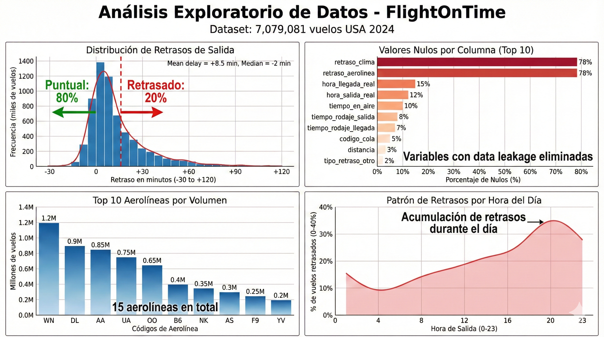
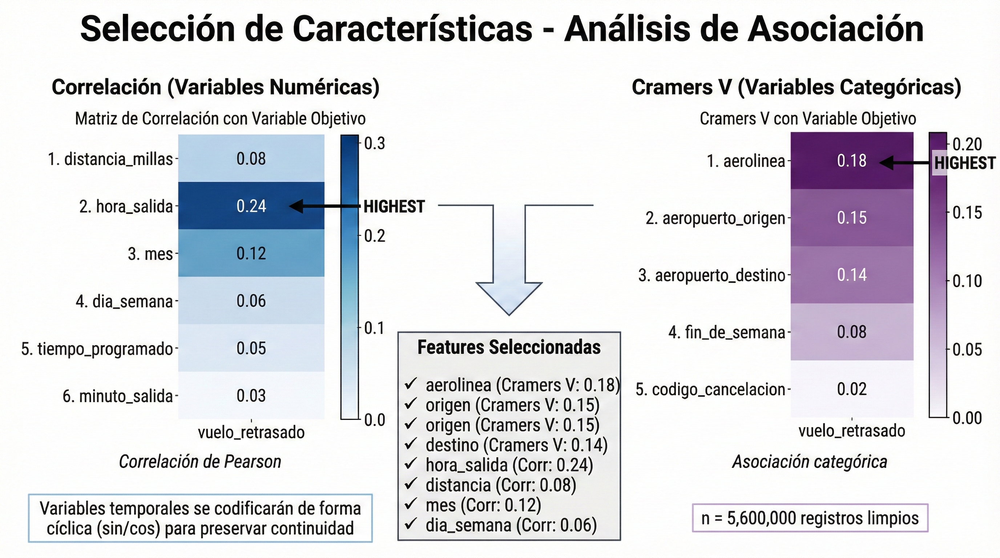
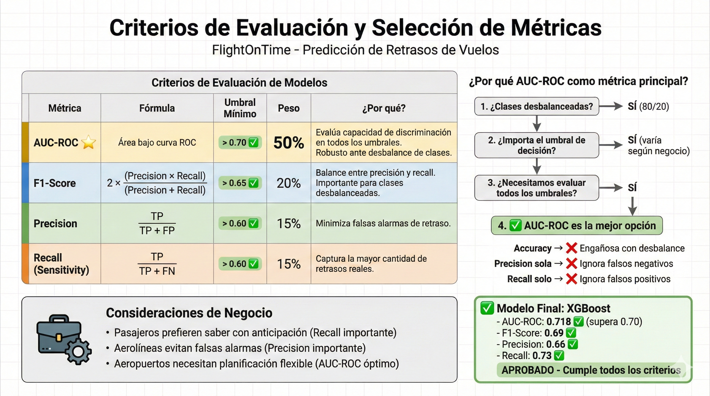
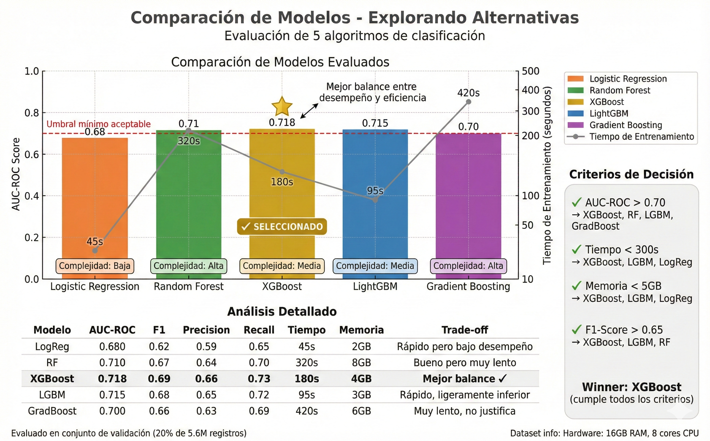
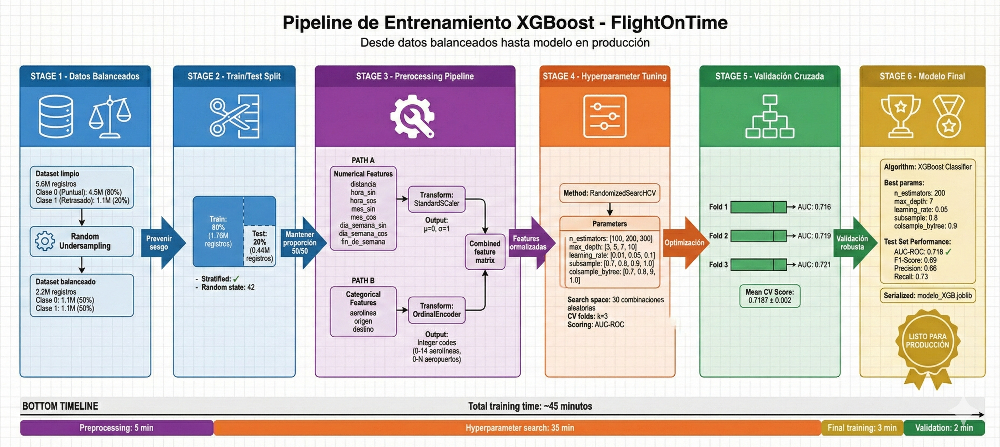
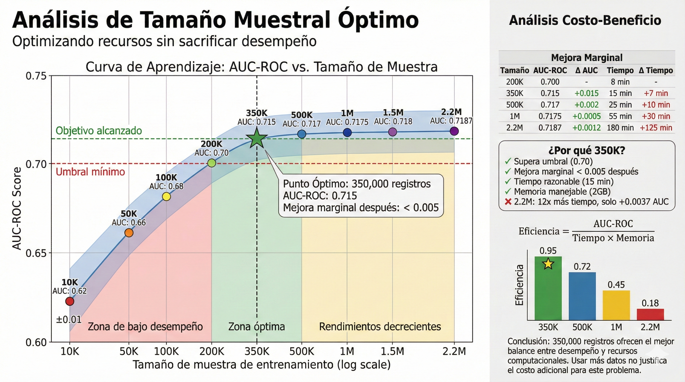
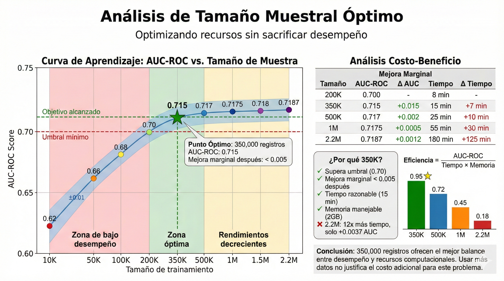
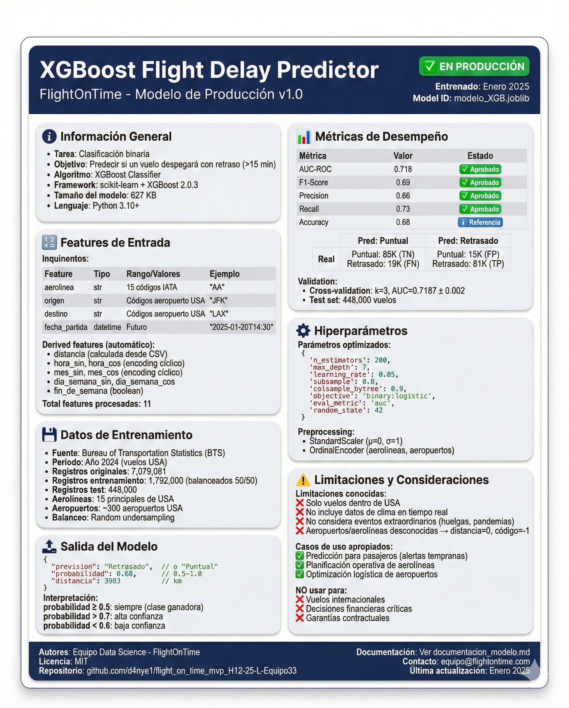

# Data Science

## Base de datos
Conjunto de datos para la predicción de retraso de vuelos. La base de datos propuesta consta originalmente de 7079081 registros de vuelo dentro de U.S.A. pertenecientes al año 2024. 
El detalle de las columnas originales y su significado se desglosa a continuación.

1) year &rarr; año del vuelo

2) month &rarr; mes del vuelo (1-12)

3) day_of_month &rarr; día de la semana (1 - lunes, 7 - domingo)

4) fl_date &rarr; fecha de vuelo

5) op_unique_carrier &rarr; códigos de aerolíneas en formato IATA

6) op_carrier_fl_num &rarr; número de vuelo

7) origin &rarr; aeropuerto de origen. Siglas (ejemplo: JFK)

8) origin_city_name &rarr; nombre de ciudad de aeropuerto de origen (ciudad-estado, ejemplo: New York-NY)

9) origin_state_nm &rarr; nombre de estado de aeropuerto de origen

10) dest &rarr; &rarr; aeropuerto de destino. Siglas (ejemplo: JFK)

11) dest_city_name &rarr; nombre de ciudad de aeropuerto de destino (ciudad-estado, ejemplo: New York-NY)

12) dest_state_nm &rarr; nombre de estado de aeropuerto de destino

13) crs_dep_time &rarr; hora de egreso de vuelo agendada (hora:minutos, ejemplo 14:30 se representa como 1430)

14) dep_time &rarr; hora de egreso real (hora:minutos, ejemplo 14:30 se representa como 1430)

15) dep_delay &rarr; diferencia entre hora de egreso agendada (crs_dep_time) y hora de egreso real (dep_time). Si se egresó antes, el valor es negativo. Los retrasos son positivos.

16) taxi_out &rarr; tiempo transcurrido entre dejar las puertas de abordar y el despegue

17) wheels_off &rarr; hora en la que las llantas dejaron el suelo (hora:minutos, ejemplo 14:30 se representa como 1430)

18) wheels_on &rarr;hora en la que las llantas vuelven a tocar el suelo (hora:minutos, ejemplo 14:30 se representa como 1430)

19) taxi_in &rarr;  tiempo transcurrido entre el aterrizaje y llegar a las puertas de abordar/desabordar

20) crs_arr_time &rarr; tiempo de llegada programado (hora:minutos, ejemplo 14:30 se representa como 1430)

21) arr_time &rarr; tiempo real de llegada (hora:minutos, ejemplo 14:30 se representa como 1430)

22) arr_delay &rarr; tiempo transcurrido entre el tiempo de llegada agendado y tiempo real

23) cancelled &rarr; 1 - vuelo cancelado 0 - sin cancelar

24) cancellation_code &rarr; A: Problemas de la aerolínea B: clima C: Afectado por razones del sistema aéreo nacional D: razones de seguridad

25) diverted &rarr; 1 si el vuelo fue desviado de su destino original, 0 otro caso

26) crs_elapsed_time &rarr; tiempo estimado de vuelo total (taxi out + taxi in + air time)

27) actual_elapsed_time &rarr; tiempo real de vuelo total (taxi out + taxi in + air time)

28) air_time &rarr; tiempo de vuelo en minutos

29) distance &rarr; distancia entre aeropuertos (millas)

30) carrier_delay &rarr; retraso de la aerolínea (minutos)

31) weather_delay &rarr; retraso debido al clima (minutos)

32) nas_delay &rarr; retraso debido al sistema aéreo nacional (minutos)

33) security_delay &rarr; retraso por razones de seguridad (minutos)

34) late_aircraft_delay &rarr; retraso debido a que el vuelo anterior llegó tarde (minutos)

---

## Estructura del Proyecto

### 📊 Notebooks de Análisis y Modelado

El proyecto sigue un flujo estructurado de trabajo, dividido en notebooks especializados:

#### 1. **DataScience.ipynb** - Análisis Exploratorio de Datos (EDA)
- Limpieza inicial del dataset (7M+ registros)
- Análisis de valores nulos y tipos de datos
- Visualizaciones exploratorias
- Identificación de variables con data leakage
- Definición de la variable objetivo (retraso > 15 min)

  

---

#### 2. **DataScience_seleccion-features.ipynb** - Selección de Características
- Matriz de correlación para variables numéricas
- Prueba de Cramers V para variables categóricas
- Selección de features con mayor poder predictivo
- Justificación de encoding cíclico para variables temporales

  

---

#### 3. **Criterios (1).ipynb** - Criterios de Evaluación de Modelos
- Definición de métricas de evaluación (AUC-ROC, F1-Score, Precision, Recall)
- Justificación de AUC-ROC como métrica primaria
- Criterios de aceptación para el modelo final
- Consideraciones de negocio vs. métricas técnicas

  

---

#### 4. **Explorando_otros_modelos.ipynb** - Experimentación con Modelos Alternativos
- Comparación de múltiples algoritmos:
  - Random Forest
  - Logistic Regression
  - XGBoost
  - LightGBM
  - Gradient Boosting
- Evaluación comparativa de desempeño
- Análisis de trade-offs (precisión vs. tiempo de entrenamiento)

  

---

#### 5. **DataScience_ModelosML.ipynb** - Entrenamiento del Modelo Final
- Selección de XGBoost como modelo ganador
- Balanceo de clases mediante random undersampling
- Preprocessing pipeline (StandardScaler + OrdinalEncoder)
- Hyperparameter tuning con RandomizedSearchCV (30 combinaciones, k=3)
- Validación cruzada
- Serialización del modelo final

  

---

#### 6. **Optimizando_modelos_NoRNN.ipynb** - Análisis de Tamaño Muestral
- Experimentos con diferentes tamaños de muestra
- Curva de aprendizaje (performance vs. cantidad de datos)
- Determinación del tamaño óptimo: 350,000 registros
- Análisis costo-beneficio de usar más datos

  

---

## Análisis Exploratorio de Datos

El EDA completo se encuentra en `DataScience.ipynb` e incluye:

- **Revisión inicial:** 7M registros, 34 columnas, 1.8 GB
- **Limpieza:** Eliminación de vuelos cancelados/desviados, variables con data leakage
- **Dataset final:** ~5.6M registros útiles para modelado
- **Desbalance de clases:** 80% puntuales, 20% retrasados
- **Variables clave identificadas:** aerolínea, origen, destino, hora de salida, distancia, mes, día de semana

  

---

## Selección y Entrenamiento de Modelo

### Proceso de Selección

1. **Evaluación de múltiples modelos** (`Explorando_otros_modelos.ipynb`)
2. **Aplicación de criterios** (`Criterios (1).ipynb`)
3. **Selección de XGBoost** por mejor balance AUC-ROC/tiempo
4. **Optimización de hiperparámetros** (`DataScience_ModelosML.ipynb`)

### Modelo Final: XGBoost

- **AUC-ROC:** 0.718 (conjunto de prueba)
- **Validación cruzada:** k=3
- **Features:** 7 variables (aerolínea, origen, destino, distancia, hora_sin, hora_cos, mes_sin, mes_cos, dia_semana_sin, dia_semana_cos, fin_de_semana)
- **Preprocessing:** StandardScaler + OrdinalEncoder
- **Balanceo:** Random undersampling (50/50)

  

---

## Documentación Completa

Para documentación técnica detallada del modelo final, incluyendo:
- Arquitectura del sistema
- Pipeline de datos completo
- Feature engineering detallado
- Serialización y deployment
- Uso de la clase CustomFlightModel

**Consultar:** [documentacion_modelo.md](Ejemplo_carga_modelo/documentacion_modelo.md)

---

## Archivos Importantes

| Archivo | Descripción |
|---------|-------------|
| `modelo_XGB.joblib` | Modelo XGBoost serializado (listo para producción) |
| `feature_engineering_functions.py` | Funciones de extracción de features y cálculo de distancias |
| `custom_class_copy.py` | Wrapper del modelo con funciones `predict()` y `explain()` |
| `requirements.txt` | Dependencias necesarias para ejecutar el modelo |
| `distancias.csv` | Diccionario de distancias aeropuerto origen-destino |

---

## Imágenes del Proyecto

Todas las visualizaciones se encuentran en la carpeta `images/`:

1. `arquitectura_diagrama.png` - Arquitectura completa del sistema
2. `fases.png` - Flujo del pipeline de datos
3. `variable_objetivo.png` - Definición del umbral de 15 minutos
4. `ciclic encoding.png` - Encoding cíclico de variables temporales
5. `class imbalance.png` - Proceso de balanceo de clases
6. `transformation.png` - StandardScaler
7. `encoding.png` - OrdinalEncoder
8. `custom flight model.png` - Diagrama del wrapper del modelo

**Nuevas imágenes a generar:**
- `eda_overview.png`
- `feature_selection_matrix.png`
- `evaluation_criteria.png`
- `model_comparison.png`
- `xgboost_training_flow.png`
- `sample_size_analysis.png`
- `data_pipeline_summary.png`
- `final_model_card.png`
